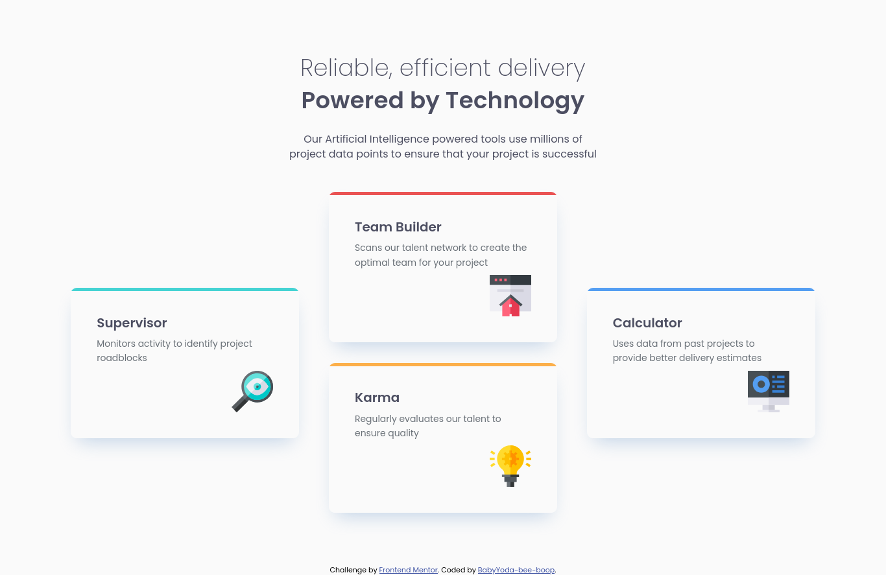
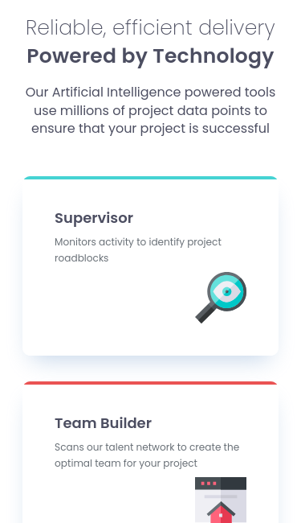

# Frontend Mentor - Four card feature section solution

This is a solution to the [Four card feature section challenge on Frontend Mentor](https://www.frontendmentor.io/challenges/four-card-feature-section-weK1eFYK). Frontend Mentor challenges help you improve your coding skills by building realistic projects.

## Table of contents

- [Overview](#overview)
  - [The challenge](#the-challenge)
  - [Screenshot](#screenshot)
  - [Links](#links)
- [My process](#my-process)
  - [Built with](#built-with)
  - [What I learned](#what-i-learned)
  - [Useful resources](#useful-resources)
- [Author](#author)

## Overview

### The challenge

Users should be able to:

- View the optimal layout for the site depending on their device's screen size

### Screenshot

 

### Links

- Solution URL: [Click here](https://babyyoda-bee-boop.github.io/card-feature-section/)
- Live Site URL: [Click here]()

## My process

### Built with

- Semantic HTML5 markup
- Mobile-first workflow
- SCSS variables
- CSS Grid

### What I learned

I've learned how to use grid and style layout using grid-template-areas.

### Useful resources

- [Josh Comeau](https://www.joshwcomeau.com/css/interactive-guide-to-grid/) - This helped me learn and apply the use of grid and grid area names

## Author

- Website - [BabyYoda-bee-boop](https://github.com/BabyYoda-bee-boop)
- Frontend Mentor - [@BabyYoda-bee-boop](https://www.frontendmentor.io/profile/BabyYoda-bee-boop)
